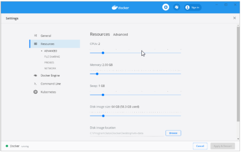

# Installing and Using Cassandra Cluster on Docker for Teaching

Dist. Algorithms Course / Dr. Miriam Allalouf

Code Contribution / **Ephi Cohen** SW Lab Manager

Cassandra Cluster Installation

A Cassandra cluster that is composed of multiple physical nodes requires separate installation and configuration of each server (here is the link: <https://cassandra.apache.org/doc/stable/cassandra/getting_started/installing.html>), enabling distributed data storage, mutual load balance, and lookup. Configuration files (`cassandra.yaml`, `cassandra-env.sh`, and more) are located in `/etc/cassandra` (<https://cassandra.apache.org/doc/stable/cassandra/getting_started/configuring.html>).

We will use a Docker environment with multiple nodes to teach Cassandra Cluster behavior. The code of the Docker with the Cassandra cluster can be viewed at this GitHub repository: <https://github.com/mirslivjce/TeachCassandraClusterWDocker> and can be run in your GitHub space. The guide to run the cluster can be found below.

## Docker with Cassandra Cluster

The best container practice is to have each one run a single application. Each node in a Cassandra cluster needs its own container, leading to multiple containers for the entire cluster. Managing several `docker run` commands with different configurations for development, testing, and production can be error-prone and time-consuming. **Docker Compose** simplifies this by allowing you to define your multi-container application in a single `docker-compose.yml` file, which specifies configurations, dependencies, environment variables, volumes, and networks.

This installation will run Cassandra using **Docker Compose** and provide a specific `docker-compose.yml` file to create and run the cluster. The following installation guide is a modified version of the guide in the following link: <https://www.instaclustr.com/blog/running-apache-cassandra-single-and-multi-node-clusters-on-docker-with-docker-compose/>. Docker CLI (<https://docs.docker.com/reference/cli/docker/>) is used to create and run the Docker environment.

## Prerequisite

1. Basic knowledge of containers and Docker (see the [**Docker documentation**](https://docs.docker.com/get-started/) for more insight).
2. Knowledge of [**VS Code**](https://code.visualstudio.com/) editor.

**Note** – This installation uses GitHub to install and run Cassandra. If you want to clone Docker from GitHub and install it on your laptop, please see the instructions in Appendix C. Create a multi-container environment for the Cassandra cluster using Docker Compose.

## Quick Start

1. Log in to your GitHub account and search for the <https://github.com/mirslivjce/TeachCassandraClusterWDocker> project.
2. Once you’re on the repository page at [https://github.com/mirslivjce/TeachCassandraClusterWDocker](https://github.com/mirslivjce/TeachCassandraClusterWDocker), click the green **Code** button at the top-right corner. Then, select **Codespaces** > **Create codespace on main** to launch the development environment in VS Code.

3. VS Code opens with the terminal already launched and Docker dependencies pre-installed.
   1. Type the following command in the terminal to start all the containers (Cassandra nodes in Docker):

      ```bash
      docker-compose up -d
      ```

      This operation performs the `docker-compose.yml` file and extracts the variables from the `.env` file (both files described in detail in Appendix A). During this operation, the nodes of Cassandra are raised one after another, starting with the two seed nodes (`cassandra1` and `cassandra2`) and following the creation of all the other four nodes.

   2. At the end of cluster creation, type the following command to check the cluster status:

      ```bash
      docker exec -it cassandra2 nodetool status
      ```

      The Cassandra `nodetool` application monitors the status of the Cassandra cluster. It comes with the Cassandra installation.

   3. You can access Cassandra nodes via the holding containers. Follow the subsequent commands:
      1. Create a Docker icon for the Cassandra Docker by opening the VS Code extensions marketplace (press this icon ) and searching for Docker.
      2. Select the Docker icon () on the left-hand side of VS Code and find the relevant Docker and status of the five containers (four Cassandra nodes and one Cassandra Client).
      3. To access the database from the client node, press the Docker icon and find the container holding the Cassandra client. Right-click on this line and select the "Attach Shell" command. This will open a terminal for the client node. Type in the terminal the following commands:
         1. ```bash
            pwd
            ```
            Make sure the current path is `/app`.
         2. ```bash
            python cassandraSimpleClientApp.py
            ```

            The Python script `cassandraSimpleClientApp.py` connects to the database and creates a keyspace and a table. Then it performs simple inserts, updates, and deletes.

## Appendix A: `docker-compose.yml` for Cassandra

The `docker-compose.yml` file for Cassandra defines a four-node Cassandra cluster and one node of the Cassandra client.

1. **Network cassandra-net** – Create an internal network between the nodes in the cluster.
2. **Cassandra Variables**: The Cassandra parameters are usually written in the file `/etc/cassandra/cassandra.yaml`. The parameters in the `.env` file copy the desired parameters to this file.

```yaml
# Common Cassandra Config
MAX_HEAP_SIZE=128M
HEAP_NEWSIZE=24M
CASSANDRA_MEMTABLE_HEAP_SPACE=1G
CASSANDRA_MEMTABLE_OFFHEAP_SPACE=256M
CASSANDRA_CONCURRENT_READS=8
CASSANDRA_CONCURRENT_WRITES=8
CASSANDRA_CONCURRENT_COMPACTORS=2
CASSANDRA_RPC_ADDRESS=0.0.0.0
CASSANDRA_SEEDS=cassandra-1,cassandra-2
CASSANDRA_CLUSTER_NAME=my-cluster
CASSANDRA_ENDPOINT_SNITCH=GossipingPropertyFileSnitch
CASSANDRA_DC=my-datacenter-1

# Python Client Environment
CASSANDRA_HOSTS=cassandra-1,cassandra-2
```

More details about the install: <https://hub.docker.com/_/cassandra>

## Appendix B: List of Important Docker Commands

- `docker logs -f cassandra1`
  - Presents Cassandra1 log file.
- `docker logs --tail=100 cassandra1`
  - Presents the last 100 lines of Cassandra1 log file.
- `docker exec -it cassandra1 cqlsh`
  - Runs the `cqlsh` application from Cassandra1.
- `docker exec -it cassandra1 cqlsh -e "SELECT release_version FROM system.local"`
  - Perform a select query from the `cqlsh` tool at the Cassandra1 container.
- `docker exec -it cassandra1 bash`
  - Enter the bash shell terminal from Cassandra1.
- `docker exec cassandra1 ls -lah /var/lib/cassandra`
  - View the list of files in a path.
- `docker cp cassandra1:/etc/cassandra/cassandra.yaml ./cassandra.yaml`
  - Copy a file from the container of Cassandra1 to your laptop.
- `docker cp cassandra.yaml cassandra1:/etc/cassandra`
  - Copy a file from your laptop to the container of Cassandra1.

### Container Management

- `docker stop cassandra1`
- `docker restart cassandra1`
- `docker rm cassandra1`
  - Stop, restart, or remove the Cassandra1 container.
- `docker-compose down`
  - Use `docker-compose` to stop and delete all the containers in this Docker setup.
- `docker system prune -a`
  - Delete all containers, images, and networks in Docker (Caution!).

### Additional Commands

- `docker exec cassandra1 df -h /`
- `docker exec cassandra1 free -m`
- `docker ps`
- `docker ps -a`
  - Get a list of all containers in Docker (including stopped ones).
- `docker stats cassandra1`
  - Track the resources of the Cassandra1 container.
- `docker exec -it cassandra_client python /app/myscript.py`
  - Execute a Python script from the Cassandra client.
- `docker exec -it cassandra_client python -c "print('Hello from Cassandra Client')"`
  - Execute Python code from the Cassandra client.
- `docker exec -it cassandra_client pip install requests`
  - Install packages using `pip` in the Cassandra client.

## Appendix C: Installing Cassandra Docker on Your Laptop

- Make sure your machine/laptop meets the following requirements:
  - At least eight cores, 12GB RAM, and 10GB disk capacity (recommended SSD disk).
  - Installed Docker and Docker Compose.
  - Available resources for the Docker engine.
  - VS Code editor installed.


